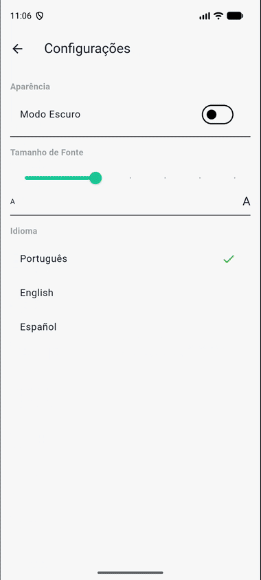
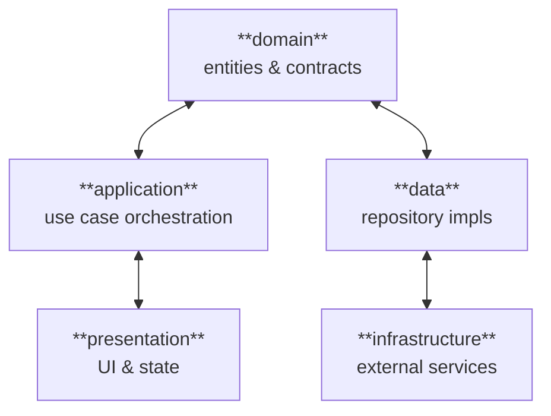
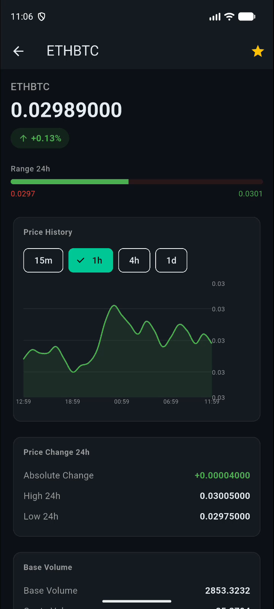
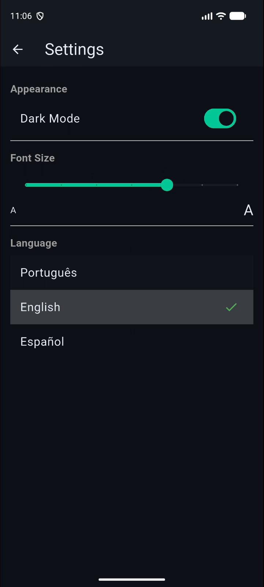
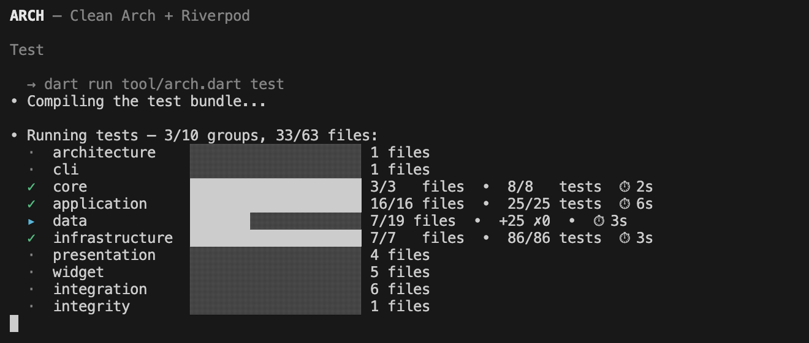
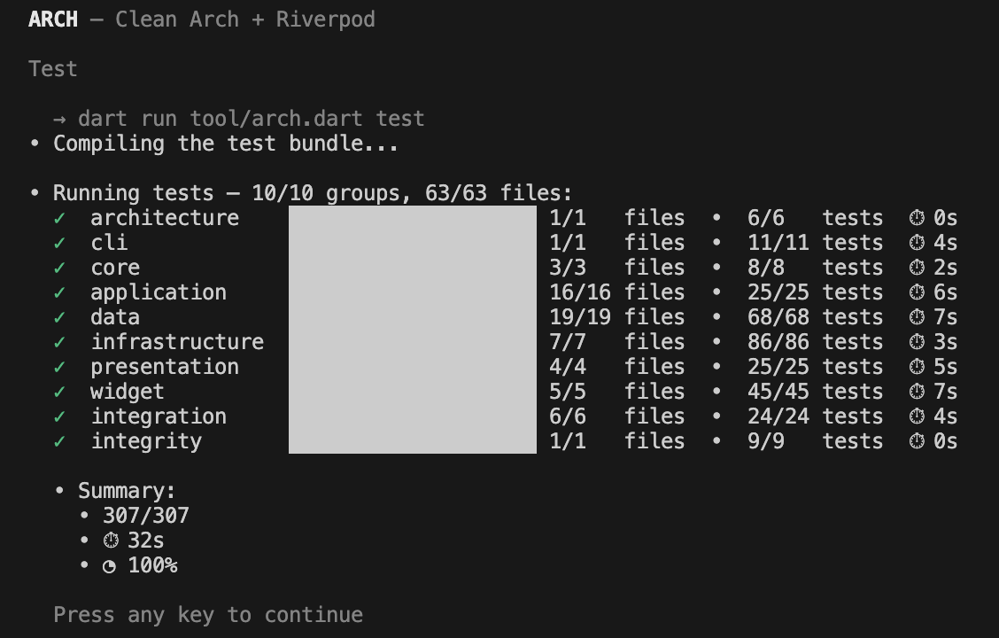
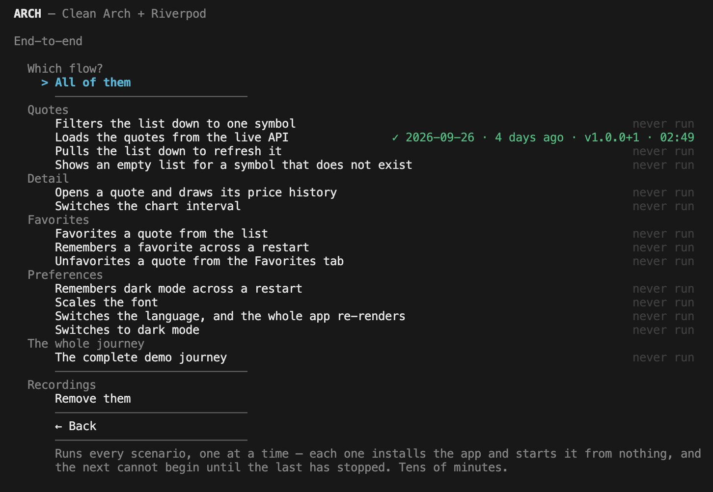
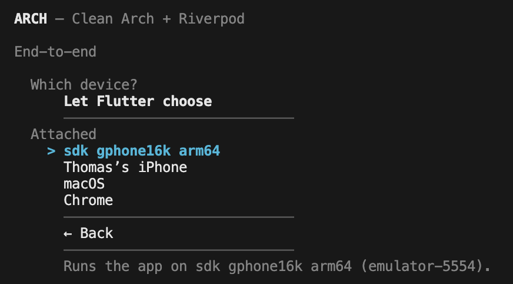
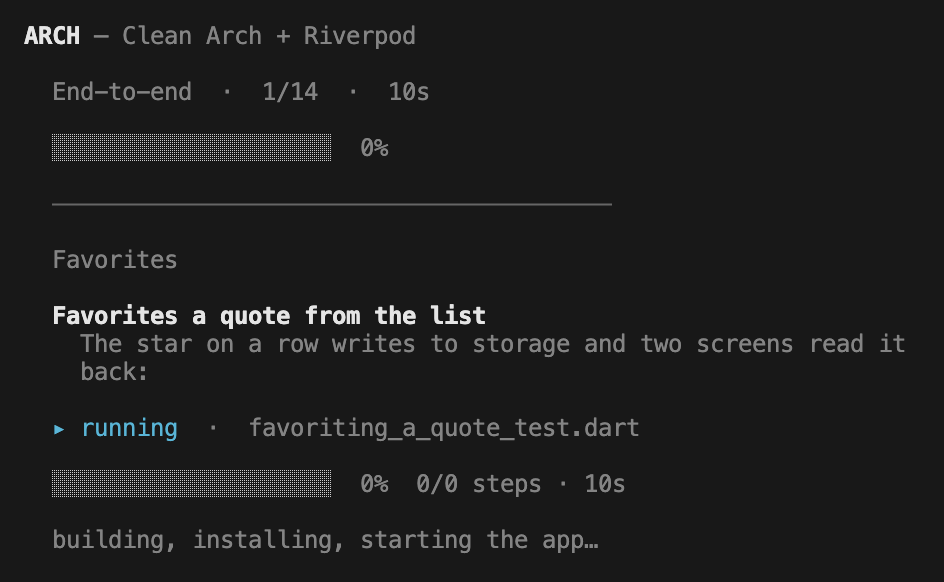

# Flutter: Clean Arch + Riverpod

A simple Flutter app built to demonstrate **Clean Architecture** in practice, using **Riverpod** for state management/DI and **AutoRoute** for navigation. It's a small crypto quotes app. Intentionally simple so the architecture, not the feature set, stays the focus.

<p align="center">
  
</p>

<sub>Screen recording of the complete E2E journey (`integration_test/app_test.dart`) driving the real app against the live Binance API on an Android emulator. No mockups, no hand-held demo.</sub>

## Architecture at a Glance



## Architecture: Clean Arch, DDD, Community standards, Google guidelines

Based on Evans' DDD layers, Uncle Bob's Clean Architecture rings, Flutter/Android community conventions, and Google's own Flutter architecture guidelines, all adapted and mixed to fit a Flutter app, creating an architecture that is robust, scalable, testable, and easy to maintain.

| Folder | Responsibility |
|---|---|
| `domain/` | Business rules, entities, and repository contracts |
| `application/` | Rule orchestration — use cases |
| `presentation/` | UI and state management |
| `data/` | Repository implementations and data sources — satisfies the contracts declared in `domain/`, and is where an infrastructure failure becomes a domain `Failure` |
| `infrastructure/` | Raw external dependencies (Dio, SharedPreferences), reached only through contracts (`HttpClientInterface`, `StorageInterface`) so they can be swapped without touching repository logic. Imports no other layer, and no Dio type crosses its contracts |
| `core/` | Cross-cutting utilities (config, failures, l10n, theme, routing) |

### What crosses the `data` boundary

`data/` has two halves, and the split between them is deliberate:

- A **datasource** resolves data. It calls `HttpClientInterface` or
  `StorageInterface`, parses the payload into a DTO/DAO, and hands back the
  infrastructure's own failure type — `HttpClientFailure`, `StorageFailure` —
  untouched.
- A **repository implementation** is the boundary, in both directions. It maps
  the DTO/DAO to an entity *and* the infrastructure failure to a domain
  `Failure`, because it is the class that implements a contract `domain/`
  declared. Nothing below it is obliged to know the domain's vocabulary, and
  nothing above it may see infrastructure's. The mapping itself lives in
  `repositories_impl/failure_mappers.dart`, so `infrastructure/` imports no
  other layer at all — the architecture test holds it to that.

Translating in the datasource is easier to write and worse to live with: an
infrastructure failure is not only something to report, it is an input to a
decision. A repository that composed two sources would need to tell
`StorageFailure.read()` from `HttpClientFailure.network()` to know whether
anything is wrong at all — a missing cache entry is not an error when the
network answers. A datasource that already flattened both into
`Failure.storage()` has thrown that distinction away. The repository is the
first class that sees every source, which makes it the last one that can still
tell them apart.

---

## Folder Structure

```
/lib
├── application/                           # Use cases: orchestration between domain and data
│   ├── favorites/                            ## Favorites use cases
│   ├── preferences/                          ## Preferences use cases
│   └── quotes/                               ## Crypto quotes & klines use cases
├── core/                                  # Cross-cutting utilities shared across layers
│   ├── constants/                            ## Global constants (app config)
│   ├── either/                               ## Either: a sealed Left/Right result type, importable from any layer
│   ├── failures/                             ## Domain failures, following a Result pattern
│   ├── l10n/                                 ## Internationalization (generated ARB output)
│   ├── routes/                               ## Routing (AutoRoute) and its DI
│   └── theme/                                ## App theme and colors
├── data/                                  # Data layer: access and repository implementations
│   ├── data_objects/                         ## Data transfer/mapping objects
│   │   ├── *_dao.dart                            ### Local persistence mapping
│   │   └── *_dto.dart                            ### REST API mapping
│   ├── data_sources/                         ## Data sources: resolve data, infra failures pass through
│   │   └── *_datasource.dart
│   └── repositories_impl/                    ## The contracts, implemented: DTO/DAO to entity, infra failure to Failure
│       ├── failure_mappers.dart                  ### HttpClientFailure / StorageFailure → Failure
│       └── *_repository_impl.dart
├── domain/                                # Domain layer: business rules and contracts
│   ├── entities/                             ## Domain entities
│   └── repositories/                         ## Repository contracts
│       └── *_repository_interface.dart
├── infrastructure/                        # Infrastructure layer: external services behind contracts
│   ├── http_client/                          ## HTTP client
│   │   ├── dio/                                  ### Dio implementation (with retry interceptor)
│   │   ├── models/                               ### Internal models (ApiRoute, HttpMethod, response)
│   │   ├── http_client_failure.dart              ### HTTP layer failures
│   │   └── http_client_interface.dart            ### HTTP client contract
│   └── storage/                              ## Local persistence
│       ├── shared_preferences/                   ### SharedPreferences implementation
│       ├── storage_failure.dart                  ### Persistence layer failures
│       └── storage_interface.dart                ### Persistence contract
└── presentation/                          # Presentation layer: UI and state management
    ├── providers/                             ## State management (Riverpod)
    │   ├── */*_notifier.dart                     ### Notifiers: state logic
    │   └── */*_state.dart                        ### Possible UI states
    ├── failures/                              ## Failure → localized message, and the SnackBar for a failed command
    ├── screens/                               ## Screens
    └── widgets/                               ## Reusable widgets
```

## Failures, end to end

Every operation that can fail returns an `Either<Failure, T>` — the
project's own sealed type in `core/either/`, not a package, so a `switch`
over it must handle both sides. A failure travels as a value from the
adapter that caught the exception to the screen that shows it:

- **Infrastructure** catches the exception and returns its own failure
  (`HttpClientFailure`, `StorageFailure`), carrying primitives only.
- **Repositories** translate it into a domain `Failure`
  (`repositories_impl/failure_mappers.dart`), and refuse a malformed row
  rather than fill it with zeros: a row that does not convert is dropped and
  logged, and a payload where none converts is `Failure.parse()`.
- **Notifiers** keep the last good value. A failed first load is a `failure`
  state; a failed save, toggle or reload is returned to the caller and the
  state stays as it was — the app is themed from the preferences state, so
  losing it would repaint the app with the defaults.
- **Screens** say it in the user's language (`presentation/failures/`): a
  failed load is drawn in place of the content, a failed command is a
  SnackBar over content that is still there.

## Dependencies

| Package | Role |
|---|---|
| [`flutter_riverpod`](https://pub.dev/packages/flutter_riverpod) / [`riverpod_annotation`](https://pub.dev/packages/riverpod_annotation) / [`riverpod_generator`](https://pub.dev/packages/riverpod_generator) | Dependency injection and state management |
| [`auto_route`](https://pub.dev/packages/auto_route) / [`auto_route_generator`](https://pub.dev/packages/auto_route_generator) | Declarative, type-safe navigation |
| [`dio`](https://pub.dev/packages/dio) | HTTP client, wrapped behind `HttpClientInterface` |
| [`shared_preferences`](https://pub.dev/packages/shared_preferences) | Local key-value persistence, wrapped behind `StorageInterface` |
| [`freezed`](https://pub.dev/packages/freezed) / [`json_annotation`](https://pub.dev/packages/json_annotation) / [`json_serializable`](https://pub.dev/packages/json_serializable) | Immutable entities/DTOs, union-type UI states, and JSON (de)serialization |
| [`intl`](https://pub.dev/packages/intl) / [`intl_utils`](https://pub.dev/packages/intl_utils) / `flutter_localizations` | Internationalization (`core/l10n`) |
| [`fl_chart`](https://pub.dev/packages/fl_chart) | Kline (candlestick) chart rendering |
| [`mocktail`](https://pub.dev/packages/mocktail) | Mocking for unit tests |
| `build_runner` (dev) | Code generation runner for Riverpod, AutoRoute, Freezed and json_serializable |


## Features
- Live crypto quotes list with pull-to-refresh and symbol filtering
- Quote detail screen with a candlestick (kline) chart
- Favorite/unfavorite quotes, with a dedicated favorites tab
- User preferences: dark mode, font scale, and locale
- Internationalization (English, Spanish, Portuguese)

## App Screens

| Quotes list | Detail & chart | Favorites | Settings |
|:---:|:---:|:---:|:---:|
|  |  |  |  |

## Getting Started

### 1. Configure the Flutter environment

```bash
make fvm
```

This automation installs FVM (if needed) and pins the Flutter SDK to the version this project expects (see `.fvmrc`), so your local `flutter` matches what CI/other contributors use.

### 2. Run the app

```bash
make run          # or `flutter run`
```

### 3. Run the tests

```bash
make flutter-test              # everything, as a live dashboard, with coverage
make flutter-test-unit         # test/unit only — every class in isolation
make flutter-test-widget       # test/widget only — screens and widgets, mocked
make flutter-test-integration  # test/integration only — real cross-layer flows
make flutter-test-e2e          # the e2e scenarios, and what each one did last
make flutter-test-e2e SCENARIO="Scales the font"   # run one, recorded
make flutter-test-arch         # the layer graph, asserted against the imports
```

## The `arch` CLI

Every task in this repository is one command, and they all live in one place:
[`tool/arch.dart`](tool/arch.dart). Run it with no arguments and it opens a
navigable menu; run it with a subcommand and it does the same work
non-interactively, which is what CI uses. `make` is a one-line face over the
same thing — nothing in `tool/` ever calls back into `make`.

```bash
make arch                      # the menu
make verify                    # format, analyze, codegen gate, tests, coverage gate
make doctor                    # can this machine build the repository?
make flutter-test-diff         # only the tests this branch's diff maps to
make flutter-test-last         # only the tests the files you just edited map to
make coverage-last             # coverage of the file you just changed, in seconds
make help                      # every target
```

### The test dashboard

One row per group, filling as its files land; the summary is tests, wall clock
and coverage.

| Running | Done |
|:---:|:---:|
|  |  |

### End-to-end

Every scenario with when it last ran, against which build, and how long it
took — then one device, one flow, narrated step by step.

| The flows | The device | Running one |
|:---:|:---:|:---:|
|  |  |  |

The full tour — the two faces, how the test dashboard is grouped, how coverage
is measured once and read three ways, and how to add a command — is in
[`docs/technical/cli.md`](docs/technical/cli.md).

## Five Test Levels, 100% Coverage

Tests across five levels, in four directories. 100% coverage.

| Level | Status | Scope | Run with |
|---|---|---|---|
| Unit | ✅ Implemented | Every class in isolation: use cases, repository implementations, data sources, notifiers, DTOs/DAOs, DI providers, and infrastructure clients (collaborators mocked via `mocktail`) | `make flutter-test-unit` |
| Widget | ✅ Implemented | Screens and widgets rendered in a real widget tree, driven by `WidgetTester` (tap, drag, pump) against mocked repositories | `make flutter-test-widget` |
| Integration | ✅ Implemented | Cross-layer flows with the **real** classes wired together (use case → repository → data source); only the true external boundary — network or platform channel — is faked | `make flutter-test-integration` |
| E2E | ✅ Implemented | The real app on a device/emulator against the live Binance API, driven through the UI with the [`integration_test`](https://pub.dev/packages/integration_test) package. One named flow at a time, each run photographed step by step and filmed — see [`docs/technical/cli.md`](docs/technical/cli.md#end-to-end) | `make flutter-test-e2e` |
| Integrity | ✅ Implemented | The repository rather than the product: `test/integrity/architecture_test.dart` reads every import under `lib/` and asserts the layer graph, the layers that must stay Flutter-free, and that Dio and SharedPreferences stay behind their contracts; `cli_test.dart` drives the `arch` CLI as a process | `make flutter-test-arch` |

<p align="center">
  
</p>

## License

Released under the [MIT License](LICENSE).
